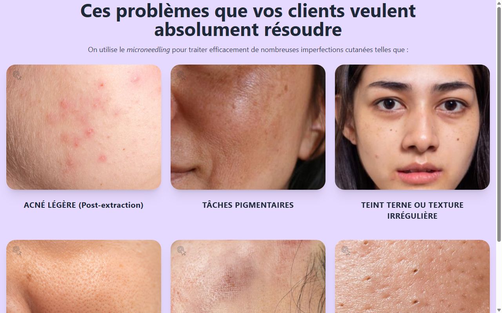

# Layout Technique — LE MICRONEEDLING Slide 2

**Course:** LE MICRONEEDLING  
**Slide:** 2  
**Live URL:** https://v0-recreate-same-layout.edtechiecorp.com  
**Stack:** Next.js · Tailwind CSS · TypeScript · GitHub Pages  

## What this slide does

An early-module slide that introduces the visual layout and content structure used throughout the microneedling course. At slide 2, learners receive a foundational overview of the technique — what microneedling is, how the device works, and what skin concerns it addresses — presented in a consistent visual layout that matches the rest of the course materials.

## Screenshot

## Usage

This slide is embedded as an iframe inside Coassemble at the live URL above. DNS is managed via Cloudflare (`edtechiecorp.com`). To update the slide, push to the `main` branch — GitHub Actions will rebuild and redeploy automatically.
